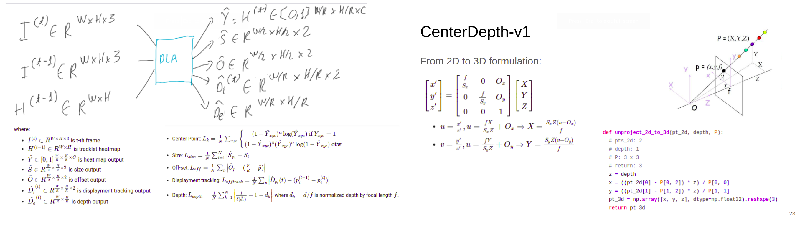

# CenterDepth
Repository for the Applied Rotation Program (ARP) project: "CenterDepth: Depth Estimation for Traffic Sign based on CenterTrack"

[This link](https://drive.google.com/drive/folders/1yQsjauYOKAmVXP8M8w7fTCSyxYt-93_P?usp=sharing) is the demo videos.




## Guideline
### To prepare:
Install prerequisite packages:
```sh
python -m pip install -r requirements.txt
```

Copy and unzip the datasets:
```sh
cp -a /vinai-auto-pilot/traffic-sign/habui_ARP/data.zip <repo_directory>
unzip data.zip
```

### To run experiments:
```sh
for i in {1..3}; do
     taskset -c <cpu_index> python main.py --config <config_path> --exp_idx $i --gpu_idx <gpu_index>
done
```
where the parameters are the following:
- `<cpu_index>`: CPU index. E.g., `<cpu_index> = "1"`
- `<config_path>`: path stored configuration hyper-parameters. E.g., `<config_path> = "algorithms/cd_regression_v1/configs/simulated.json"`
- `<gpu_index>`: GPU index. E.g., `<gpu_index> = "0"`

**Note:** Select different settings by editing in `/configs/..json`, logging results are stored in `/results/logs/`, checkpoints are stored in `/results/checkpoints/`

### To visualize objective functions:

```sh
tensorboard --logdir <logdir>
```
where `<logdir>`: absolute path stored TensorBoard results. E.g., `<logdir> = "/home/ubuntu/source-code/CenterDepth/algorithms/cd_regression_v1/results/tensorboards/simulated_0"`


### To export demo video:
